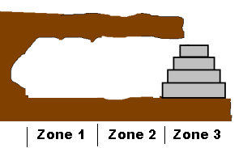

# Sujet
Vous avancez prudemment sur une corniche le long d'une falaise ; vous devez accéder au sommet de la paroi.

Vous tombez finalement sur un renfoncement. Au fond de cette petite grotte se trouve un magnifique empilement de quatre gros disques de pierre ! En déplaçant cette pile de disques sur la corniche, vous pourrez l'escalader et atteindre le haut de la falaise.

<h1 align="center">
  

    
    Structure actuelle de la grotte
  

  

    
    Résultat recherché
  

</h1>

L'empilement est malheureusement très lourd, même pour votre robot : celui-ci ne peut porter qu'un seul disque à la fois. De plus, il semble évident qu'un disque ne pourra pas supporter un disque plus gros que lui. Moyennant cela, il va vous falloir reformer l'empilement à l'entrée de la grotte, dans un espace très exigu.

## Ce que doit faire votre programme :
On peut considérer qu'il y a trois zones dans la grotte :

zone 1 : le fond, où se trouvent les quatre cylindres, empilés du plus large au plus étroit ;
zone 2 : le centre, où vous pouvez placer temporairement des disques les uns au-dessus des autres ;
zone 3 : l'entrée de la grotte, où vous devez reformer l'empilement complet.
Le but est de déplacer tous les disques de la zone 1 à la zone 3 en respectant ces deux règles :

on ne peut déplacer qu'un disque à la fois, car ils sont très lourds ;
on ne peut jamais poser un disque sur un disque plus petit que lui, car sinon l'empilement s'effondrerait !