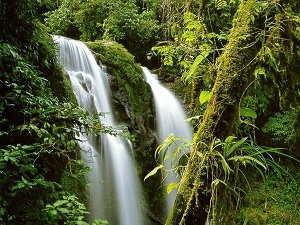
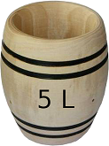

# Sujet
Vous voici arrivé(e) tout en haut de la montagne. Vous allez enfin pouvoir libérer le chef du village ! Vous tombez des nues lorsque vous l'apercevez en train de discuter tranquillement avec le Grand Sorcier. Loin de s'être fait kidnapper par ce dernier, il l'a rejoint pour préparer une mixture en vue de la célébration qui a lieu dans quelques jours.

La mixture en question est composée de trois ingrédients à mélanger en proportions parfaitement exactes : 5 volumes d'huile, 4 volumes d'eau, et 3 volumes d'un ingrédient secret. Le chef et le Grand Sorcier disposent de deux tonneaux non gradués de contenances 5 litres et 3 litres, avec lesquels ils pourront facilement doser l'huile et l'ingrédient secret. Mais il leur manque le tonneau de 4 litres car le chef l'a oublié au village !

<h1 align="center">
  
  
</h1>

Chute d'eau Tonneau de 5 litres Tonneau de 3 litres
Si l'on transfère le contenu d'un tonneau dans l'autre, jusqu'à avoir vidé le premier ou rempli le second, par le calcul, on peut savoir précisément combien d'eau se trouve dans chacun des deux tonneaux. Ainsi, vous vous dites qu'il doit bien y avoir un moyen d'utiliser les tonneaux disponibles pour mesurer exactement 4 litres d'eau. Vous utilisez votre robot pour chercher la solution.

## Ce que doit faire votre programme :
Vous vous trouvez devant une source d'eau qui jaillit de la montagne, et vous disposez de deux tonneaux vides de capacités 5 litres et 3 litres. Écrivez un programme qui effectue une série de transvasements permettant d'obtenir exactement 4 litres d'eau dans le plus grand tonneau.

**Arrêtez-vous bien dès que le grand tonneau contient exactement 4 litres.**