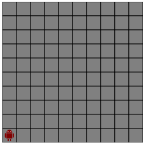

# Sujet

C'est enfin l'heure du Grand Événement ! Le chef du village ouvre la grande porte dans la falaise et vous découvrez avec stupéfaction un superbe palais. Les villageois apportent alors toutes leurs offrandes à la divinité qui habite ce palais : des fruits, du goma, du vin, et même un borlok. Heureusement que les portes ont été ouvertes à temps, sinon la divinité se serait vengée en détruisant tout le village.

Le chef vous prend alors à l'écart et vous explique son problème. L'onguent qu'il a préparé avec le Grand Sorcier aurait dû être étalé au sol dans tout le palais, car les capacités hallucinogènes de ce mélange sont nécessaires à l'apparition de la divinité. Il a pris du retard et, comme il n'a pas le temps de l'étaler, il souhaiterait que vous l'aidiez. Pour cela, il vous fournit un plan du palais.

## Ce que doit faire votre programme :
Le palais est un grand carré de taille 10×10, et le robot se trouve au départ dans le coin en bas à gauche, comme représenté ci-dessous :

<h1 align="center">
  
</h1>

Votre robot doit passer une et une seule fois dans chacune des pièces, puis se retrouver dans sa case de départ.


### Commandes pour cet exercice
Les quatre instructions ci-dessous permettent de déplacer le robot d'une case dans une direction.

```
haut();
bas();
gauche();
droite();
```

Voici un programme d'exemple qui déplace le robot de quelques cases.

```cpp
#include <iostream>
#include "robot.h"
using namespace std;
int main()
{
   haut();
   haut();
   droite();
}
```